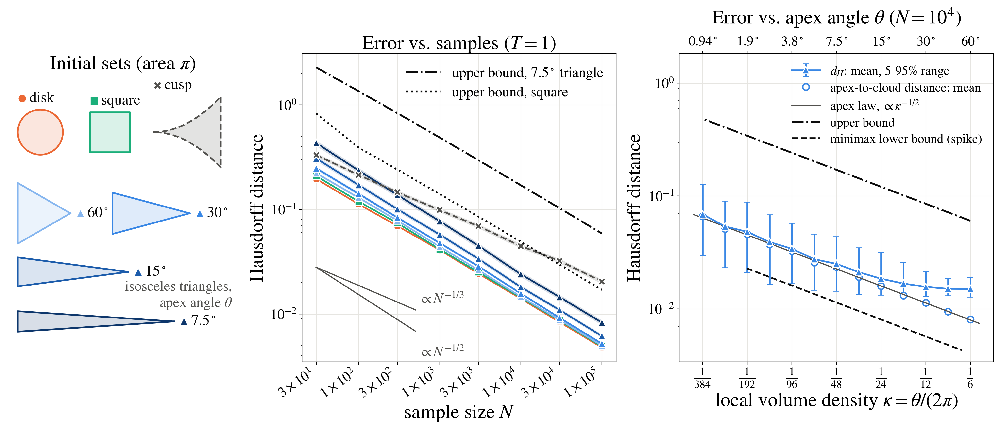
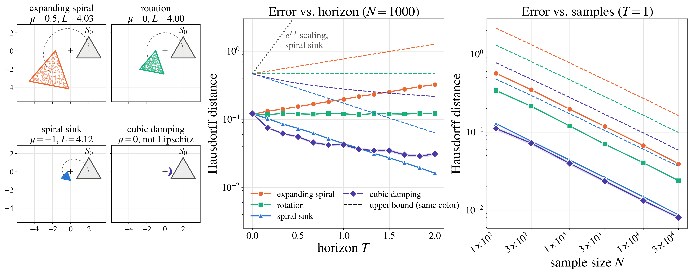
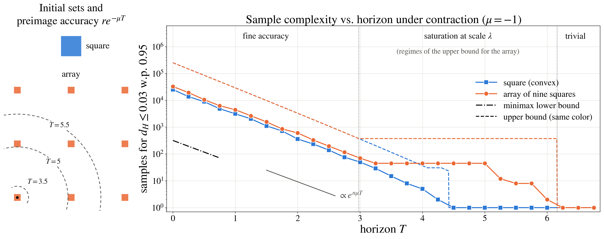

# On the Limits of Sampling-Based Reachability: Geometry, Dynamics, and Sample Complexity

<div align="center">

**Jixian Liu · Ihab Tabbara · Hussein Sibai · Enrique Mallada**

*10th Conference on Robot Learning (CoRL 2026), Austin, TX*

[](https://www.python.org/)
[](https://mujoco.org/)
[](https://www.corl.org/)

</div>

This repository contains the code for every experiment in the paper.  Each experiment has one script,
and the raw per-trial results behind it ship in `results/`.

Sampling-based reachability propagates finitely many initial states through the dynamics and builds a set
estimate $\widehat S_N$ from the endpoints.  Existing finite-sample guarantees bound the *probability mass*
that the estimate misses.  Such a bound still allows the estimate to miss a thin region of the reachable
set that is spatially far from the rest.  We study the
geometric question instead: **how many endpoint samples are needed so that $d_H(S_T,\widehat S_N)\le r$**,
where $S_T = \mathcal R_T(S_0)$ is the reachable set of $\dot x = F(x)$ from the initial set $S_0$?


## Theoretical results

Three regularity conditions make a probability-mass guarantee upgradable to Hausdorff accuracy:

* **Geometry:** the complement of $S_0$ has positive reach $r_0$, which rules out cusps and thin parts.
* **Dynamics:** $F$ is $L$-Lipschitz, so the flow distorts distances by at most $e^{LT}$.
* **Sampling:** the initial density is bounded below by $\rho/|S_0|$.

Let $R$ be the volume-equivalent radius of $S_0$ and $n$ the state dimension.  Under these conditions:

| | Sample complexity | Result |
|---|---|---|
| **Upper bound** (any estimator containing the samples) | $N \ge \dfrac{2^{2n}e^{nLT}R^n}{\rho\, r^n}\Big[\log\dfrac{2^{3n}e^{nLT}R^n}{r^n} + \log\dfrac1\delta\Big]$ | Theorem 1 |
| **Minimax lower bound** (every estimator fails on some instance) | $N < \dfrac{e^{nLT}R^n}{2^{n+1} r^n}\log\dfrac{1}{2\delta}$ | Theorem 2 |

The two bounds match up to logarithmic factors, so the burden $\tilde\Theta\big((e^{LT}R/r)^n\big)$ is
intrinsic: it is exponential in the dimension and degrades exponentially with the horizon.  This is a
property of the problem, not of any particular estimator.


## Geometry and dynamics both matter

On the globally Lipschitz system $\dot x = x,\ \dot y = 0$, three initial sets of equal area $\pi$,
centered at $(2, 0)$, are sampled uniformly, propagated by $\varphi_T(x, y) = (e^T x, y)$, and estimated
by the convex hull of the endpoints:

* **circle**, $r_0 = 1$;
* **opened triangle**, $r_0 \approx 0.309$;
* **triangle**, $r_0 = 0$, which violates the positive-reach assumption.

The error is the symmetric Hausdorff distance to the true reachable set, averaged over 50 trials (shading:
95% confidence intervals).  The black dash-dotted and dashed curves are the upper bound (Theorem 1) and
the minimax lower bound (Theorem 2), with $\delta = 0.05$ and $r_0 = 0.309$.


* **Geometry.** The triangle, which lacks positive reach, has the largest error.  The circle has the
  smallest.
* **Dynamics.** The error grows with the horizon as the flow expands the $x$-direction.  Over time the
  empirical curves run parallel to the lower-bound scale.
* **Sample size.** The decay in $N$ lies between the upper and the minimax lower bound.


## Beyond positive reach and Lipschitz constants

The extended analysis relaxes two of the three conditions above, and the bounds keep the same form.

* **Geometry:** $S_0$ only needs to be *$(\kappa, \lambda)$-standard*:
  $|\mathcal B_r(x) \cap \overline{S_0}| \ge \kappa\,\omega_n r^n$ for every $x \in \overline{S_0}$ and
  $r \le \lambda$.  Positive reach $r_0$ gives $(\kappa, \lambda) = (2^{-n}, r_0)$.  Every convex polytope is
  standard, with $\kappa$ the smallest normalized solid angle of its vertex cones, although its complement
  has zero reach.  Cusps are still excluded.
* **Dynamics:** $F$ only needs a one-sided Lipschitz constant,
  $\langle F(x) - F(y), x - y\rangle \le \mu\|x - y\|^2$, and $\mu$ may be negative.

| | Sample complexity |
|---|---|
| **Upper bound** (any estimator containing the samples) | $N \ge \dfrac{1}{\rho\kappa}\Big(\dfrac{R}{\varrho}\Big)^n\Big[\log\dfrac{2^nR^n}{\kappa\varrho^n} + \log\dfrac1\delta\Big]$ with $\varrho = \min\{\tfrac12 e^{-\mu T} r,\ \lambda\}$; one sample if $r \ge e^{\mu T}\,\mathrm{diam}(S_0)$ |
| **Minimax lower bound** ($\kappa \le \kappa_n$, e.g. $\kappa_2 \approx 0.148$) | $N < \dfrac{1}{2\rho\kappa}\Big(\dfrac{5 e^{\mu T}R}{12\, r}\Big)^n\log\dfrac{1}{2\delta}$ |

For $r \le 2e^{\mu T}\lambda$ the two match in $e^{n\mu T}(R/r)^n/(\rho\kappa)$: contraction provably reduces
the sampling burden, and neither $1/\rho$ nor the corner factor $1/\kappa$ can be removed.  The bounds are
implemented in `reachapprox/bounds.py`.

Three experiments test these statements on planar systems with closed-form flows.  In all of them the
initial sets have area $\pi$ ($R = 1$) and are sampled uniformly ($\rho = 1$), $\delta = 0.05$, and every
condition has 200 trials.  The estimator is the endpoint cloud itself: its Hausdorff distance to $S_T$ is
the inner error, and no estimator that contains the samples has a larger one.  The distance is computed
without gridding $S_T$, from the Voronoi vertices of the endpoints that lie in $S_T$ and from the boundary
of $S_T$ (`reachapprox.metrics.cloud_inner_error`).

### Corners change the constant, not the rate

Spiral sink $\dot x = \begin{bmatrix}-1 & -4\\ 4 & -1\end{bmatrix}x$ ($\mu = -1$), $T = 1$, with a disk, a
square, isosceles triangles of apex angle $\theta$ ($\kappa = \theta/2\pi$), and a cusp.



* **Rate.** Every standard set decays with log–log slope between $-0.46$ and $-0.49$ ($N^{-1/2}$ up to
  the logarithm), with or without corners.  The cusp, which is not standard, decays with slope $-0.34$
  ($N^{-1/3}$).
* **Constant.** For thin corners the error is the distance from the apex to the cloud, whose law
  $\Pr(d > s) = (1 - \kappa (e^{-\mu T}s/R)^2)^N$ is exact, and it grows like $\kappa^{-1/2}$ (fitted
  exponent $-0.49$).  The 95% quantile stays a factor 3–5 below the upper bound and a factor 3–4 above
  the lower bound, with the same slope in $\kappa$.

### The horizon enters through $\mu$, not through $L$

The equilateral triangle under $\dot x = \begin{bmatrix}\mu & -4\\ 4 & \mu\end{bmatrix}x$ and under the
cubic damping $\dot x = -\|x\|^2 x$.



| Field | $\mu$ | $L$ | fitted rate of $d_H$ in $T$ | $d_H(T{=}2)/d_H(T{=}0)$ | $e^{2\mu}$ | $e^{2L}$ |
|---|---|---|---|---|---|---|
| expanding spiral | $0.5$ | $4.03$ | $+0.50$ | $2.74$ | $2.72$ | $3.2\times10^3$ |
| rotation | $0$ | $4.00$ | $0.00$ | $1.00$ | $1$ | $3.0\times10^3$ |
| spiral sink | $-1$ | $4.12$ | $-1.00$ | $0.134$ | $0.135$ | $3.8\times10^3$ |
| cubic damping | $0$ | not globally Lipschitz | n/a | $0.256$ | $1$ | n/a |

* The error follows $e^{\mu T}$ for the three linear fields, whose Lipschitz constants are all about 4.
* For the cubic field, $\mu = 0$ guarantees that the error does not grow.  With the Lipschitz constant
  $(1 + 2T d_0^2)^{-1/2}$ of the flow map on $S_0$ ($d_0 = 0.954$ is the distance from the origin to $S_0$)
  in place of $e^{\mu T}$, the bound decreases as well (dashed); the measured error decreases faster because
  the flow contracts the radial direction more than the tangential one.
* The dynamics shift the error-vs-$N$ curves by $e^{\mu T}$ and leave their slope unchanged.

### Contraction and the three regimes

Spiral sink, fixed accuracy $r = 0.03$: the number of samples after which $d_H \le r$ in 95% of the trials,
for a convex square and for nine distant squares of the same total area.



* **Fine accuracy.** The sample complexity decays like $e^{n\mu T}$: fitted rates $-2.08$ (square) and
  $-2.02$ (array) against $n\mu = -2$.  The upper bound is parallel, a factor 5–11 above.
* **Saturation.** Once the accuracy pulled back to $S_0$ exceeds the size of a piece, every piece of the
  array must still be hit: the empirical complexity stays at 45 for $T \in [3.25, 5]$ (the 95% quantile of
  the coupon-collector time for nine pieces is 44), and the bound stays at 376.  The convex square keeps
  improving.
* **Trivial accuracy.** One sample suffices once $r \ge \mathrm{diam}(S_T)$: from $T = 4.5$ for the square
  (bound: $4.43$) and from $T = 6.25$ for the array (bound: $6.16$).


## Experiments

Each experiment is one script in `experiments/`.  Its per-trial results are saved in
`results/<experiment>/`.

* **Quadratic flow illustration** (`quadratic_flow_illustration`)
  * *System:* the non-globally-Lipschitz flow $\dot x = x^2,\ \dot y = 0$,
    $\varphi_T(x, y) = (x/(1 - Tx), y)$.
  * *Initial sets:* a unit disk and a five-pointed star of the same circumradius, centered at $(2, 0)$,
    sampled uniformly.
  * *Estimator and error:* the convex hull on a $170 \times 170$ grid, and the symmetric Hausdorff
    distance to 35,000 propagated points; 50 trials.
  * *Sweeps:* $N \in \{10, \dots, 10^4\}$ at $T = 0.22$, and $T \in [0.01, 0.33]$ at $N = 1000$.
* **Lipschitz bound validation** (`lipschitz_bound_validation`)
  * *Setting:* the experiment shown above.
  * *Sweeps:* $N \in \{3\times10^2, \dots, 3\times10^5\}$ at $T = 1$, and $T \in [0.01, 2]$ at $N = 1000$.
* **Density lower bound** (`density_lower_bound`)
  * *System:* the unit disk centered at $(1, 0)$, $\dot x = 2x,\ \dot y = 0$, $T = 0.5$.
  * *Sampling:* densities $p_\beta \propto (1 - r)^\beta$ with $\beta \in \{0, 2, 4\}$.  They share the same
    support and vanish at the boundary for $\beta > 0$.
  * *Estimators:* convex hull, union of balls of radius $h = 0.05$, and Christoffel sublevel set
    (degree 6).
  * *Trials:* $N \in \{10, \dots, 10^6\}$, 50 seeds, 5–95% bands.
* **Robot-arm dimension scaling** (`robotarm_dimension_scaling`, with `robotarm_slope_fit`)
  * *System:* vertical planar $n$-link arms in MuJoCo, $n \in \{2, 3, 4\}$, state $x = [q, v] \in \mathbb R^{2n}$.
    Links have length 0.5, capsule radius 0.035, density 1000, damping 0.2 and armature 0.01; the time
    step is $2\times10^{-3}$ s.
  * *Controller:* a non-adaptive inverse-dynamics tracking controller,
    $\tau = M(q)\ddot q_d + C(q,v)v + g(q) - K_p e - K_d\dot e$, with $K_p = 0.01$, $K_d = 0.005$ and
    $|\tau| \le 100$.  The reference is $q_{d,i}(t) = q_{c,i} + 0.08\sin(0.5t + \phi_i)$.
  * *Initial set and horizon:* $[-0.1, 0.1]^{2n}$, propagated to $T = 1$.
  * *Sampling:* uniform, or Algorithm 1 with $n_{\rm adv} = 1$ and $\eta = 0.05$.
  * *Estimator and error:* the convex hull of the endpoints, and the directed Hausdorff distance from
    2,000 of 20,000 reference endpoints to it; $N \in \{1, \dots, 3000\}$, 30 seeds.
  * *Slope fit:* `robotarm_slope_fit` fits the inverse-rate exponent linearly in the state dimension, $1/|{\rm slope}(d)| \approx a d + c$.
  * *Summary figure:* `robotarm_scaling_summary` re-plots both in one figure labeled by the state dimension.
* **Robot-arm time sweep** (`robotarm_time_sweep`)
  * *Setting:* the same arms with uniform sampling and $N = 1000$.
  * *Sweep:* $T \in [0.01, 2]$ (11 values), with a 5,000-point reference cloud and 5 seeds.
  * *Error:* directed Hausdorff distance from 1,000 of the reference endpoints to the samples.
* **Adversarial sampling intensity** (`adversarial_intensity`)
  * *System:* $\dot x = x^2,\ \dot y = 0$ with the circle, opened triangle and triangle.
  * *Sampling:* $N \in \{10, 100, 1000\}$ endpoints from Algorithm 1 with $n_{\rm adv} \in \{0, \dots, 4\}$
    ($n_{\rm adv} = 0$ is uniform sampling).
  * *Estimators and error:* convex hull and Christoffel sublevel set; Hausdorff distance to a
    12,000-point reference over $T \in [0.01, 0.29]$; 50 trials.
* **Corner-angle scaling** (`corner_angle_scaling`)
  * *System:* the spiral sink $\dot x = Mx$, $M = \begin{bmatrix}-1 & -4\\ 4 & -1\end{bmatrix}$, with
    $\varphi_T = e^{-T}\,\mathrm{Rot}(4T)$, $\mu = -1$ and $L = \sqrt{17}$; $T = 1$.
  * *Initial sets:* area $\pi$, sampled uniformly: a disk, a square, isosceles triangles with apex angle
    $\theta$ ($\kappa = \theta/2\pi$), and the cusp $\{0 < u < 3,\ |v| < \tfrac{\pi}{2}(u/3)^2\}$, which is not standard.
  * *Estimator and error:* the endpoint cloud, and its exact Hausdorff distance to $S_T$; 200 trials.
  * *Sweeps:* $N \in \{30, \dots, 10^5\}$ for $\theta \in \{60^\circ, 30^\circ, 15^\circ, 7.5^\circ\}$, and
    $\theta$ from $60^\circ$ down to $0.94^\circ$ at $N = 10^4$.
* **One-sided Lipschitz horizon** (`one_sided_lipschitz_horizon`)
  * *Systems:* $\dot x = \begin{bmatrix}\mu & -4\\ 4 & \mu\end{bmatrix}x$ with $\mu \in \{0.5, 0, -1\}$
    ($L \approx 4$ in all three), and the cubic damping $\dot x = -\|x\|^2x$ with flow
    $\varphi_T(x) = x/\sqrt{1 + 2T\|x\|^2}$, for which $\mu = 0$ and no global Lipschitz constant exists.
  * *Initial set:* the equilateral triangle of area $\pi$ centered at $(2, 0)$.
  * *Estimator and error:* as above; 200 trials.
  * *Sweeps:* $T \in [0, 2]$ (13 values) at $N = 1000$, and $N \in \{10^2, \dots, 3\times10^4\}$ at $T = 1$.
* **Contraction regimes** (`contraction_regimes`)
  * *System:* the spiral sink above, $T \in [0, 6.75]$.
  * *Initial sets:* area $\pi$: a square, and nine squares of side $0.59$ on a lattice of pitch $4.73$.
  * *Sample complexity:* for $r = 0.03$, the 95% quantile over 200 trials of the first $N$ with
    $d_H(S_T, \{Y_1, \dots, Y_N\}) \le r$.  The flow is a similarity, so one error curve per trial, evaluated
    on a grid of $N$ with ratio $2^{1/8}$, gives this hitting time for every horizon.


## Installation

```shell
python -m venv .venv && source .venv/bin/activate
pip install -r requirements.txt
```

MuJoCo is needed only to *run* the robot-arm experiments.  Re-plotting from the shipped
CSVs and all planar experiments need only NumPy, SciPy, Matplotlib and Shapely.


## Reproduce

Run every command from the repository root.  Each script writes per-trial results to `results/<experiment>/trials.csv`
and then plots from them.  `--plot-only` skips the experiment and regenerates the figures and tables from
the shipped CSVs, in seconds.

```shell
python -m experiments.quadratic_flow_illustration
python -m experiments.lipschitz_bound_validation
python -m experiments.density_lower_bound
python -m experiments.adversarial_intensity
python -m experiments.robotarm_dimension_scaling   # MuJoCo
python -m experiments.robotarm_slope_fit           # uses the output of robotarm_dimension_scaling
python -m experiments.robotarm_scaling_summary     # re-plots the two robot-arm results above
python -m experiments.robotarm_time_sweep          # MuJoCo
python -m experiments.corner_angle_scaling
python -m experiments.one_sided_lipschitz_horizon
python -m experiments.contraction_regimes
```

Regenerate all figures and tables from the shipped results:

```shell
for s in quadratic_flow_illustration lipschitz_bound_validation robotarm_dimension_scaling \
         density_lower_bound robotarm_time_sweep adversarial_intensity \
         corner_angle_scaling one_sided_lipschitz_horizon contraction_regimes; do
    python -m experiments.$s --plot-only
done
python -m experiments.robotarm_slope_fit
python -m experiments.robotarm_scaling_summary
```

Useful options:

```shell
# subsets of the sweeps
python -m experiments.robotarm_dimension_scaling --methods uniform --n_values 2 --budgets 1,10,100
python -m experiments.density_lower_bound --budgets 10,100,1000 --seeds 10
python -m experiments.adversarial_intensity --estimators christoffel

# robot arm: distance to the samples themselves instead of to their convex hull
python -m experiments.robotarm_dimension_scaling --metric point_cloud

# tests
python -m pytest
```

## Code structure

```text
reachapprox/                        # shared library
├─ flows.py                         # analytic flows: x' = x^2 (+ Jacobian), x' = a x, spiral x' = M x, x' = -|x|^2 x
├─ geometry.py                      # disk, star, triangles, square, square array; standardness constants of
│                                   # convex polygons; uniform sampling, boundary points, projection
├─ estimators.py                    # convex hull, Christoffel sublevel set, evaluation grids
├─ metrics.py                       # Hausdorff distances between clouds, boundaries and estimates;
│                                   # exact distance between a planar set and a sample cloud
├─ bounds.py                        # bounds for standard sets and one-sided Lipschitz fields, solved for N or r
├─ adversarial.py                   # Algorithm 1 for the planar quadratic system
├─ utils.py                         # seeding, 95% CIs, CSV I/O, plotting helpers
└─ robotarm/
   ├─ arm.py                        # MuJoCo n-link arm, inverse-dynamics tracking controller, parallel rollouts
   ├─ sampling.py                   # uniform box sampling and Algorithm 1 on the box
   └─ metrics.py                    # directed Hausdorff to the sample cloud / to its convex hull
experiments/                        # one script per experiment; python -m experiments.<name>
├─ quadratic_flow_illustration.py   # x' = x^2, disk vs. star
├─ lipschitz_bound_validation.py    # x' = x, empirical error vs. Theorems 1-2
├─ robotarm_dimension_scaling.py    # robot arm, uniform vs. adversarial
├─ density_lower_bound.py           # vanishing boundary density
├─ robotarm_slope_fit.py            # slope vs. state dimension
├─ robotarm_scaling_summary.py      # robot arm, both results in one figure
├─ robotarm_time_sweep.py           # robot arm, error vs. horizon
├─ adversarial_intensity.py         # number of adversarial updates
├─ corner_angle_scaling.py          # corners: error vs. local volume density kappa
├─ one_sided_lipschitz_horizon.py   # error vs. horizon for fields with different (mu, L)
└─ contraction_regimes.py           # sample complexity vs. horizon under contraction
results/<experiment>/               # per-trial CSVs, tables, and figures, one folder per script
tests/                              # flows, geometry, estimators, samplers, metrics, bounds
```


## Citation

```bibtex
@inproceedings{liu2026limits,
  title     = {On the Limits of Sampling-Based Reachability: Geometry, Dynamics, and Sample Complexity},
  author    = {Liu, Jixian and Tabbara, Ihab and Sibai, Hussein and Mallada, Enrique},
  booktitle = {Conference on Robot Learning (CoRL)},
  year      = {2026}
}
```
