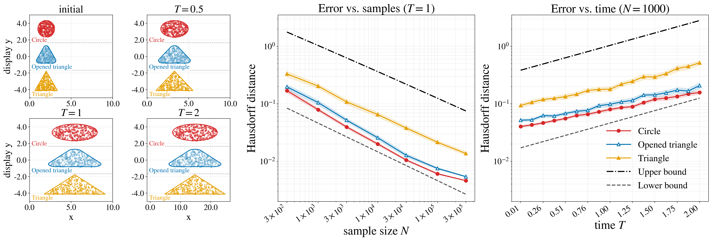
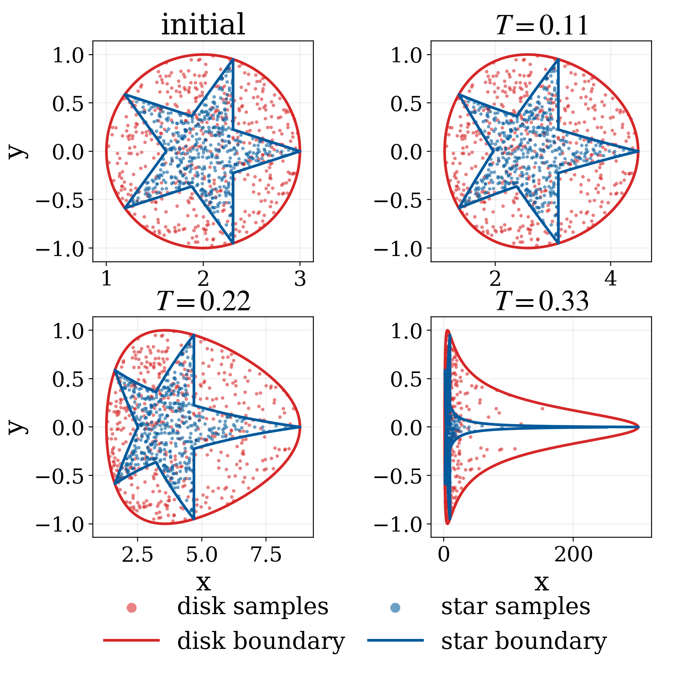
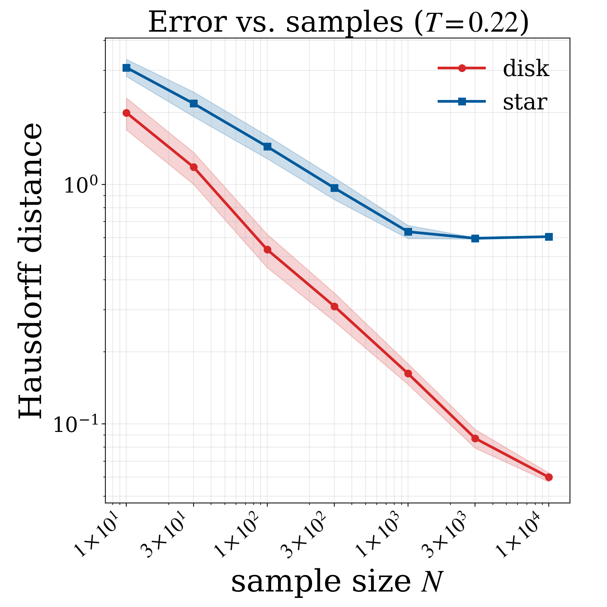
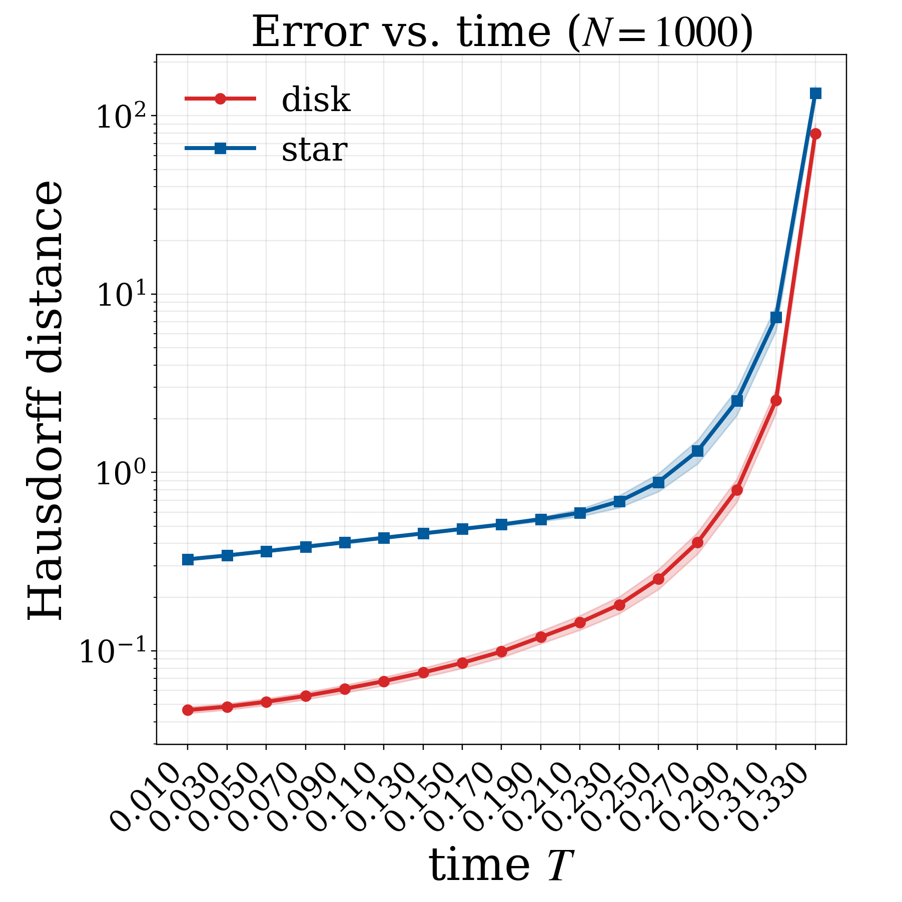
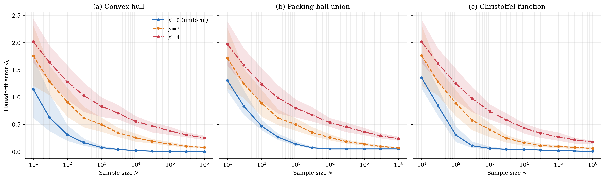
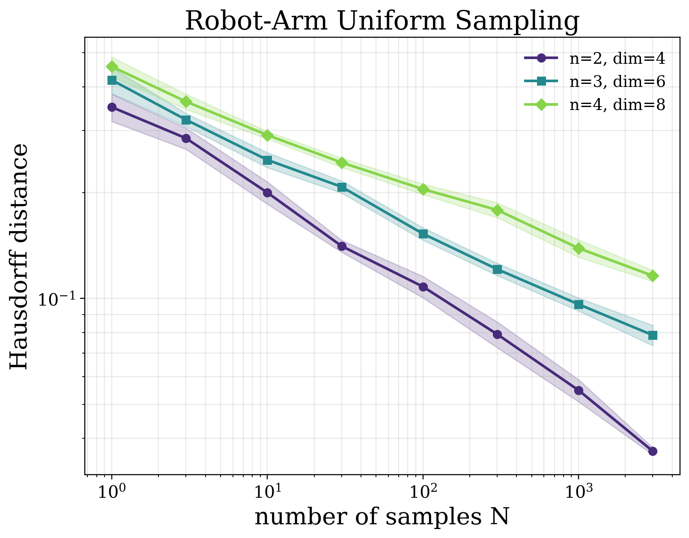
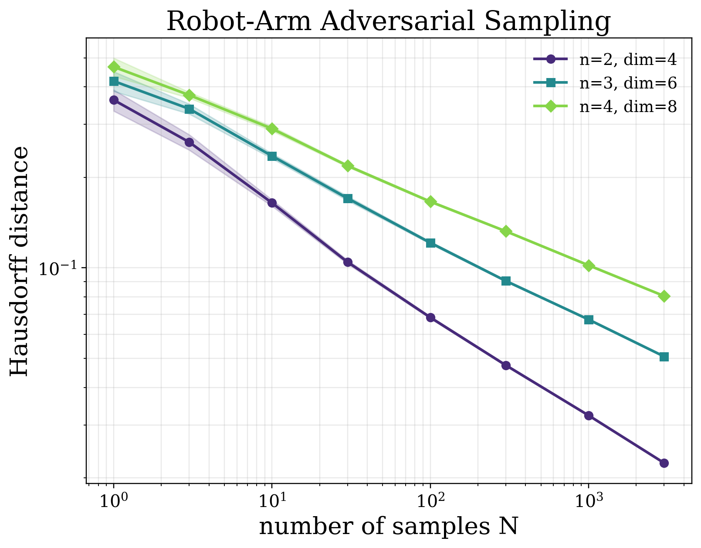
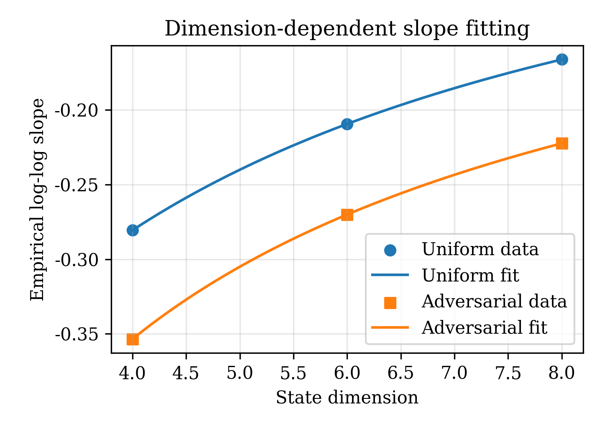
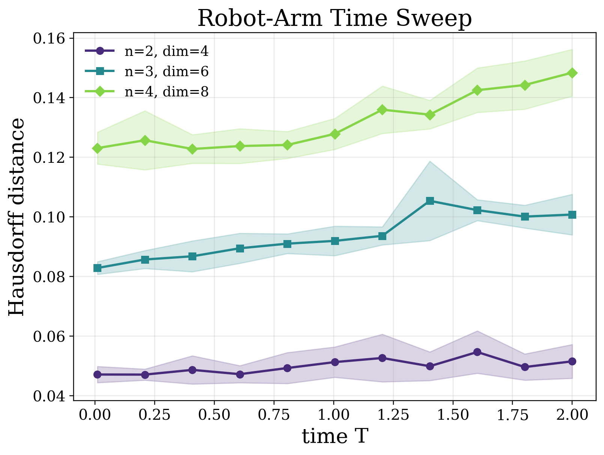
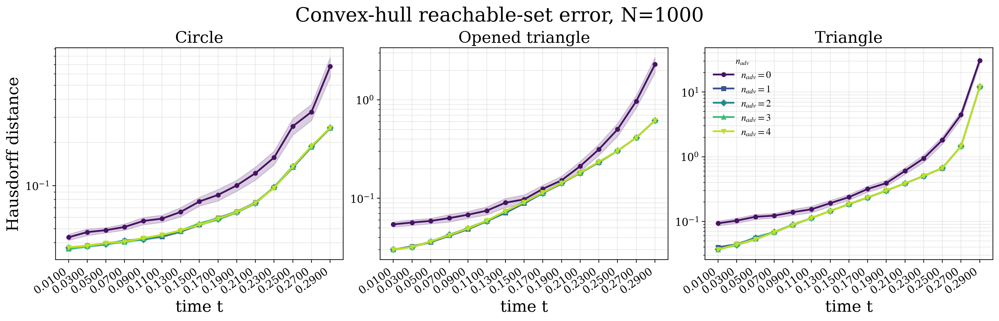

# On the Limits of Sampling-Based Reachability: Geometry, Dynamics, and Sample Complexity

<div align="center">

**Jixian Liu · Ihab Tabbara · Hussein Sibai · Enrique Mallada**

*10th Conference on Robot Learning (CoRL 2026), Austin, TX*

[](https://www.python.org/)
[](https://mujoco.org/)
[](https://www.corl.org/)



</div>

This repository contains the code for every experiment in the paper.  Each figure and table
has one script, and the raw per-trial results behind it ship in `results/`.

Sampling-based reachability propagates finitely many initial states through the dynamics and builds a set
estimate $\widehat S_N$ from the endpoints.  Existing finite-sample guarantees bound the *probability mass*
that the estimate misses.  Such a bound still allows the estimate to miss a thin region of the reachable
set that is spatially far from the rest.  We study the
geometric question instead: **how many endpoint samples are needed so that $d_H(S_T,\widehat S_N)\le r$**,
where $S_T = \mathcal R_T(S_0)$ is the reachable set of $\dot x = F(x)$ from the initial set $S_0$?


## Main results

Three regularity conditions make a probability-mass guarantee upgradable to Hausdorff accuracy:

* **Geometry:** the complement of $S_0$ has positive reach $r_0$, which rules out cusps and thin parts.
* **Dynamics:** $F$ is $L$-Lipschitz, so the flow distorts distances by at most $e^{LT}$.
* **Sampling:** the initial density is bounded below by $\rho/|S_0|$.

Let $R$ be the volume-equivalent radius of $S_0$ and $n$ the state dimension.  Under these conditions:

| | Sample complexity | Result |
|---|---|---|
| **Upper bound** (any estimator containing the samples) | $N \ge \dfrac{2^{2n}e^{nLT}R^n}{\rho\, r^n}\Big[\log\dfrac{2^{3n}e^{nLT}R^n}{r^n} + \log\dfrac1\delta\Big]$ | Theorem 1 |
| **Minimax lower bound** (every estimator fails on some instance) | $N < \dfrac{e^{nLT}R^n}{2^{n+1} r^n}\log\dfrac{1}{2\delta}$ | Theorem 2 |

The two bounds match up to logarithmic factors, so the burden $\tilde\Theta\big((e^{LT}R/r)^n\big)$ is
intrinsic: it is exponential in the dimension and degrades exponentially with the horizon.  This is a
property of the problem, not of any particular estimator.  The experiments show that adversarial sampling
improves the constants but not the scaling.


## Results

### Geometry and dynamics both matter (Figures 1 and 2)

**Figure 1.** On the non-Lipschitz system $\dot x = x^2,\ \dot y = 0$, the error for the star (inward
cusps) saturates as $N$ grows.  At fixed $N$, the error blows up as the flow stretches neighborhoods.

Initial sets and flow | Error vs. sample size | Error vs. horizon
:-------------------------:|:-------------------------:|:-------------------------:
 |  | 

**Figure 2** (top of the page) uses the Lipschitz system $\dot x = x,\ \dot y = 0$.  The circle
($r_0 = 1$) and the opened triangle ($r_0 \approx 0.309$) satisfy the positive-reach assumption; the
triangle ($r_0 = 0$) does not and has the largest error.  Over time the empirical curves run parallel to
the minimax lower-bound scale, and they sit between the two theoretical curves.

### The density lower bound is needed (Figure 6)

**Figure 6.** The same disk support, dynamics and horizon are sampled with densities
$p_\beta \propto (1-r)^\beta$, which vanish at the boundary for $\beta > 0$.  Full support alone does not
give a uniform rate.  At $N = 10^6$ the Christoffel error is 0.0068, 0.0605 and 0.1800 for
$\beta = 0, 2, 4$.



### The curse of dimensionality survives adversarial sampling (Figures 3 and 7, Tables 2–4)

**Figure 3.** Closed-loop MuJoCo $n$-link arms with state dimension $2n \in \{4, 6, 8\}$, propagated to $T = 1$.

Uniform sampling | Adversarial sampling | Slope fit (Figure 7)
:-------------------------:|:-------------------------:|:-------------------------:
 |  | 

**Table 2.** Log–log slopes of the mean Hausdorff error against $N$:

| State dimension | 4 | 6 | 8 |
|---|---|---|---|
| Uniform sampling | −0.2806 | −0.2094 | −0.1662 |
| Adversarial sampling | −0.3535 | −0.2701 | −0.2224 |

* **Adversarial vs. uniform.** Adversarial sampling has the steeper slope in every dimension, and it
  improves the mean error at $N = 3000$ by 39%, 36% and 31% (Table 4).  These adversarial numbers come
  from the shipped paper data; a fresh rerun does not reproduce them (see [Notes](#notes)).
* **Dimension.** Both methods flatten as the dimension grows.
* **Fit (Table 3).** The fit $|{\rm slope}(d)| \approx 1/(a d^b + c)$ gives the following inverse-rate
  exponents $a d^b + c$:
  * uniform: $0.5049\,d^{1.0709} + 1.3353$;
  * adversarial: $0.9488\,d^{0.7203} + 0.2535$.

  Both exponents grow with the dimension.

### Supplementary experiments (Figures 8–10)

Robot-arm error vs. horizon (Figure 8) | Adversarial intensity, convex hull, $N = 1000$ (Figure 9)
:-------------------------:|:-------------------------:
 | 

* **Figure 8.** Under the tracking controller the error grows only slowly with $T$.  The worst-case
  $e^{nLT}$ is a minimax rate, not an instance rate.
* **Figures 9 and 10.** These sweep the number of adversarial updates $n_{\rm adv}$ for the convex-hull
  and Christoffel estimators.  Adversarial updates help only once the budget is large enough to keep
  global coverage.


## Installation

```shell
python -m venv .venv && source .venv/bin/activate
pip install -r requirements.txt
```

MuJoCo is needed only to *run* the robot-arm experiments (Figures 3 and 8).  Re-plotting from the shipped
CSVs and all planar experiments need only NumPy, SciPy, Matplotlib and Shapely.


## Reproduce the paper

Run every command from the repository root.  Each script writes per-trial results to `results/<experiment>/trials.csv`
and then plots from them.  `--plot-only` skips the experiment and regenerates the figures and tables from
the shipped CSVs, in seconds.

| Paper item | Command | Run time* |
|---|---|---|
| Figure 1 | `python -m experiments.quadratic_flow_illustration` | ~10 min |
| Figure 2 | `python -m experiments.lipschitz_bound_validation` | ~6 min |
| Figure 3, Table 2, Table 4 | `python -m experiments.robotarm_dimension_scaling` | ~70 min |
| Figure 6 | `python -m experiments.density_lower_bound` | ~50 min |
| Figure 7, Table 3 | `python -m experiments.robotarm_slope_fit` (reads `results/robotarm_dimension_scaling/loglog_slopes.csv`) | seconds |
| Figure 8 | `python -m experiments.robotarm_time_sweep` | ~30 min (estimate) |
| Figures 9 and 10 | `python -m experiments.adversarial_intensity` | ~12 min |

\*On a 16-thread AMD Ryzen 7 7735HS.  The robot-arm scripts spread MuJoCo rollouts over all CPU cores;
the other scripts are single-threaded.

Regenerate every figure and table from the shipped results:

```shell
for s in quadratic_flow_illustration lipschitz_bound_validation robotarm_dimension_scaling \
         density_lower_bound robotarm_time_sweep adversarial_intensity; do
    python -m experiments.$s --plot-only
done
python -m experiments.robotarm_slope_fit
```

Useful options:

```shell
# subsets of the sweeps
python -m experiments.robotarm_dimension_scaling --methods uniform --n_values 2 --budgets 1,10,100
python -m experiments.density_lower_bound --budgets 10,100,1000 --seeds 10
python -m experiments.adversarial_intensity --estimators christoffel

# robot arm: distance to the convex hull of the samples instead of to the samples
python -m experiments.robotarm_dimension_scaling --metric convex_hull

# tests
python -m pytest
```

Figures 4 and 5 are schematic drawings, and Table 1 restates Theorems 1 and 2, so none of them has a script.


## Code structure

```text
reachapprox/                     # shared library
├─ flows.py                      # analytic flows: x' = x^2 (+ Jacobian), x' = a x
├─ geometry.py                   # disk, star, (opened) triangle; uniform sampling, boundary points, projection
├─ estimators.py                 # convex hull, Christoffel sublevel set, evaluation grids
├─ metrics.py                    # Hausdorff distances between clouds, boundaries and estimates
├─ adversarial.py                # Algorithm 1 for the planar quadratic system
├─ utils.py                      # seeding, 95% CIs, CSV I/O, plotting helpers
└─ robotarm/
   ├─ arm.py                     # MuJoCo n-link arm, inverse-dynamics tracking controller, parallel rollouts
   ├─ sampling.py                # uniform box sampling and Algorithm 1 on the box
   └─ metrics.py                 # directed Hausdorff to the sample cloud / to its convex hull
experiments/                     # one script per experiment; python -m experiments.<name>
├─ quadratic_flow_illustration.py   # Figure 1: x' = x^2, disk vs. star
├─ lipschitz_bound_validation.py    # Figure 2: x' = x, empirical error vs. Theorems 1-2
├─ robotarm_dimension_scaling.py    # Figure 3, Tables 2 and 4: robot arm, uniform vs. adversarial
├─ density_lower_bound.py           # Figure 6: vanishing boundary density
├─ robotarm_slope_fit.py            # Figure 7, Table 3: slope vs. state dimension
├─ robotarm_time_sweep.py           # Figure 8: robot arm, error vs. horizon
└─ adversarial_intensity.py         # Figures 9 and 10: number of adversarial updates
results/<experiment>/               # per-trial CSVs, tables, and figures, one folder per script
tests/                           # flows, geometry, estimators, samplers, metrics
```


## Notes

* **Robot-arm error metric.**
  * *What the paper reports.* Figure 3, Tables 2–4 and Figure 8 use the directed Hausdorff distance from
    a reference endpoint cloud to the *sample cloud*, $\max_{z\in Y_{\rm ref}}\min_i\|z - Y_i\|$.  This is
    the inner error that Theorem 1 controls, and it upper-bounds the inner error of any estimator that
    contains the samples.
  * *Option.* `--metric convex_hull` measures the distance to the convex hull of the samples instead.
* **Robot-arm initial set.**
  * *Paper text.* Appendix C.1 writes $S_0$ as the box opened by a ball of radius 0.01.
  * *Code.* The experiments sample the plain box $[-0.1, 0.1]^{2n}$.  The opening only rounds the
    corners and removes a negligible fraction of the volume.
* **Adversarial robot-arm data.**
  * *Shipped data.* `results/robotarm_dimension_scaling/trials.csv` holds the per-seed errors behind the paper.  The
    uniform rows are reproduced exactly by the script.
  * *Lost version.* The adversarial rows came from an earlier, unrecorded variant of the sampler.
  * *Current sampler.* The script implements Algorithm 1 with $n_{\rm adv} = 1$ and $\eta = 0.2$.  The
    MuJoCo flow is not differentiated, so the flow Jacobian is replaced by the identity.
  * *Rerun result.* A full rerun with this sampler and the point-cloud metric gives **no improvement over
    uniform sampling**.  The adversarial slopes are −0.280, −0.212 and −0.176, against −0.281, −0.209 and
    −0.166 for uniform.  So the adversarial rows of Table 2, Table 4 and Figure 3 (right) cannot currently
    be regenerated from code.
  * *Figures 9 and 10.* The planar adversarial sampler behind these figures is fully reproducible.
* **Controller.** The paper's tracking controller is
  $\tau = M(q)\ddot q_d + C(q,v)v + g(q) - K_p e - K_d\dot e$ with $K_p = 0.01$, $K_d = 0.005$, clipped to
  $\pm100$.  The feed-forward term is computed with MuJoCo's inverse dynamics, which also compensates the
  joint damping.
* **Determinism.** Every trial has its own seed.  The planar scripts reproduce the shipped CSVs bit for
  bit.  The uniform robot-arm runs (Figure 3) and the time sweep (Figure 8) agree with the paper data to
  the 12 significant digits stored in the CSVs.


## Citation

```bibtex
@inproceedings{liu2026limits,
  title     = {On the Limits of Sampling-Based Reachability: Geometry, Dynamics, and Sample Complexity},
  author    = {Liu, Jixian and Tabbara, Ihab and Sibai, Hussein and Mallada, Enrique},
  booktitle = {Conference on Robot Learning (CoRL)},
  year      = {2026}
}
```
